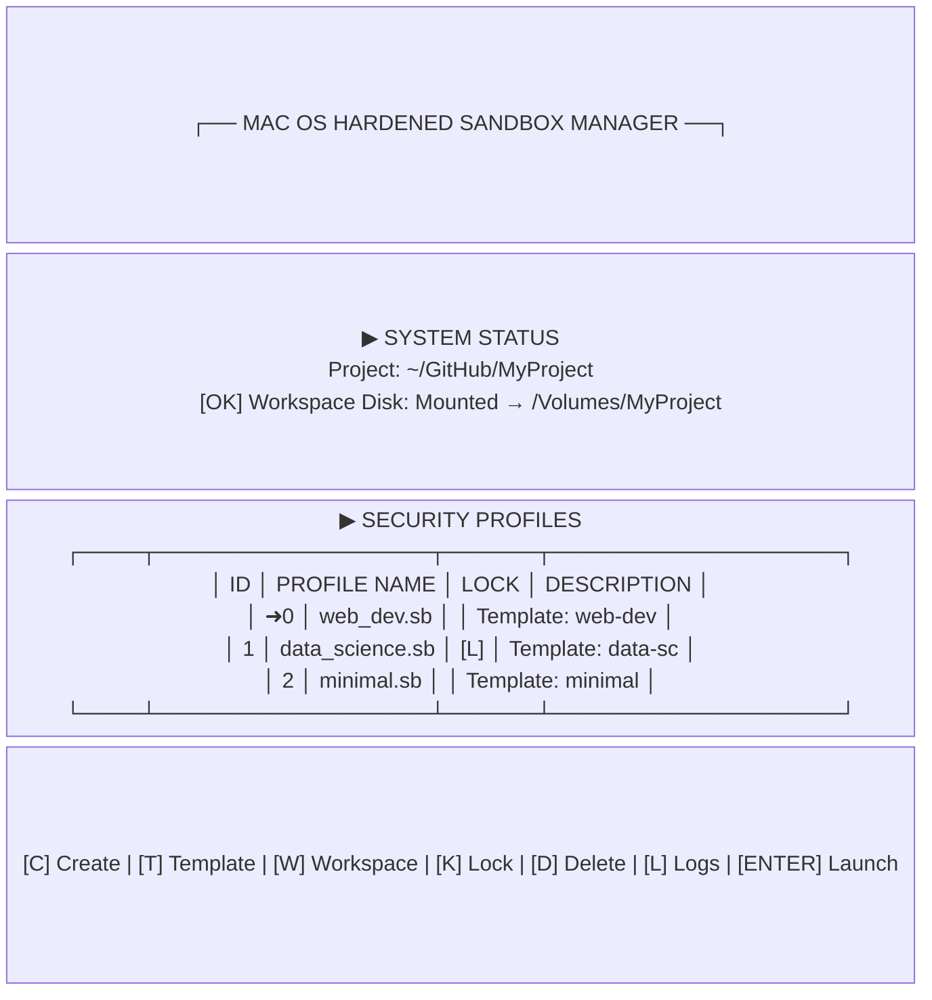
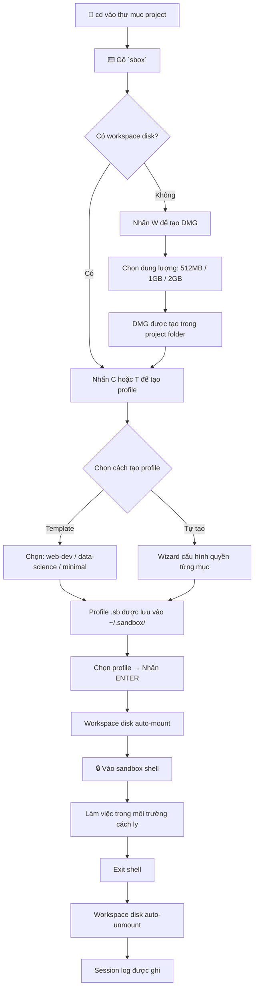
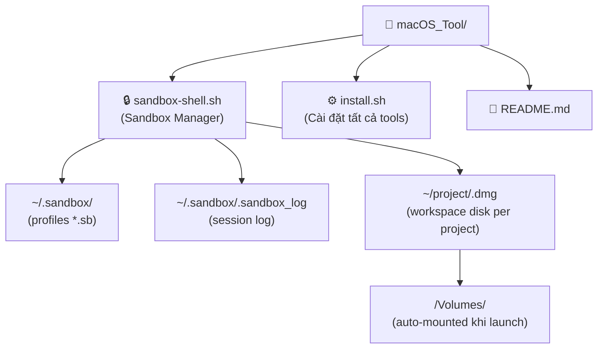

<p align="center">
  
  
  
  
</p>

<h1 align="center">🔒 macOS Tool Collection</h1>
<h3 align="center">Bộ công cụ dòng lệnh chuyên dụng cho macOS — được xây dựng bởi developer, dành cho developer</h3>

<p align="center">
  <strong>Giải quyết những việc lặt vặt nhưng quan trọng mà macOS chưa làm tốt — trực tiếp từ terminal.</strong>
</p>

---

## 📖 Giới thiệu

**macOS Tool Collection** là tập hợp các công cụ dòng lệnh nhỏ gọn, được xây dựng để giải quyết các vấn đề cụ thể trong môi trường phát triển trên macOS. Mỗi công cụ hoạt động độc lập, không phụ thuộc vào nhau, và có thể cài đặt riêng lẻ hoặc cùng nhau chỉ bằng một lệnh.

> 💡 **Triết lý thiết kế:** Mỗi công cụ giải quyết đúng một vấn đề, làm tốt một việc — không bloat, không dependency nặng nề.

---

## 🛡️ Công cụ hiện có

### 1. Sandbox Shell Manager (`sbox`)

Quản lý môi trường sandbox macOS bằng TUI — cách ly ứng dụng khỏi hệ thống mà không cần máy ảo.

<table>
<tr>
<td width="50%">

**❌ Vấn đề cũ**

- Chạy script lạ → lo ngại viết vào `/usr`, `/bin`
- Không có cách nào cách ly network dễ dàng
- `sandbox-exec` quá phức tạp, không có GUI
- Không biết ứng dụng đang access file nào
- Mỗi project dùng chung storage → lẫn lộn dữ liệu

</td>
<td width="50%">

**✅ Giải pháp với sbox**

- TUI đẹp để tạo và quản lý sandbox profile
- Toggle network IN/OUT, filesystem, USB chỉ bằng phím
- Profile template sẵn: web-dev, data-science, minimal
- Session log ghi lại thời gian, profile, exit code
- Mỗi project có workspace disk riêng (DMG) trong thư mục project

</td>
</tr>
</table>

---

## ✨ Tính năng của Sandbox Shell Manager

<table>
<tr>
<td width="50%">

**🎛️ TUI Dashboard**
- Bảng điều khiển tương tác trong terminal
- Điều hướng bằng phím mũi tên
- Hiển thị trạng thái workspace disk theo project

**🔧 Tạo profile linh hoạt**
- Wizard cấu hình từng quyền: network, filesystem, USB, IPC
- Tự scan thư mục Home và cổng USB/Serial
- Hỗ trợ thêm custom path thủ công

**📦 Template profiles sẵn có**
- `web-dev`: cho phép network outbound, block system write
- `data-science`: không có network, truy cập Documents/Downloads
- `minimal`: cách ly tối đa, chỉ MNT volume

</td>
<td width="50%">

**💾 Workspace Disk theo project**
- DMG nằm trong thư mục project, đặt tên theo project
- Tự động mount/unmount khi vào/ra sandbox
- Chọn dung lượng: 512MB, 1GB, 2GB

**🔐 Khóa profile**
- Lock profile để tránh xóa nhầm
- Toggle lock/unlock bằng phím `K`

**📋 Session Logging**
- Ghi lại thời điểm launch, profile, project, duration, exit code
- Log viewer tích hợp trong TUI (phím `L`)

**⚡ CLI Quick-launch**
- `sbox myprofile` — vào sandbox ngay, bỏ qua TUI
- `sbox --run myprofile "npm start"` — chạy lệnh rồi thoát

</td>
</tr>
</table>

---

## 🖥️ Giao diện



---

## 📦 Cài đặt

### Cách 1: Script cài đặt tự động (Khuyến nghị)

```bash
git clone https://github.com/kiendinhtrung/macOS_Tool.git
cd macOS_Tool
chmod +x install.sh
./install.sh
```

### Cách 2: Chỉ cài Sandbox Manager

```bash
./install.sh --only sandbox
```

### Cách 3: Cài thủ công

```bash
# Copy script vào thư mục scripts
mkdir -p ~/scripts
cp sandbox-shell.sh ~/scripts/
chmod +x ~/scripts/sandbox-shell.sh

# Thêm alias vào .zshrc
echo "alias sbox='~/scripts/sandbox-shell.sh'" >> ~/.zshrc
source ~/.zshrc
```

### Yêu cầu hệ thống

| Yêu cầu | Phiên bản |
|---------|-----------|
| macOS | 12 Monterey trở lên |
| Shell | `zsh` (mặc định trên macOS) |
| `hdiutil` | Có sẵn trên macOS |
| `sandbox-exec` | Có sẵn trên macOS |

---

## 🚀 Quy trình sử dụng



---

## 🗂️ Cấu trúc project



---

## ⌨️ Phím tắt

| Phím | Chức năng |
|------|-----------|
| `↑` / `↓` | Di chuyển giữa các profile |
| `ENTER` | Launch sandbox với profile được chọn |
| `C` | Tạo profile mới bằng wizard |
| `T` | Tạo profile từ template có sẵn |
| `W` | Tạo workspace disk cho project hiện tại |
| `K` | Toggle lock/unlock profile |
| `D` | Xóa profile (không xóa được nếu đang locked) |
| `L` | Xem session log |
| `CTRL+C` | Thoát |

---

## 🔧 Công nghệ sử dụng

| Công nghệ | Mục đích |
|-----------|---------|
| `bash` | Ngôn ngữ viết script chính |
| `sandbox-exec` | Engine thực thi sandbox Apple Sandbox Profile |
| `hdiutil` | Tạo và quản lý DMG disk image |
| `tput` + ANSI | Vẽ TUI trong terminal |
| Apple Sandbox Profile (`.sb`) | Định nghĩa luật cách ly: network, filesystem, process |

---

## 📋 Cấu hình

| File | Vị trí | Mô tả |
|------|--------|-------|
| Profiles | `~/.sandbox/*.sb` | Các security profile |
| Session log | `~/.sandbox/.sandbox_log` | Log toàn bộ session |
| Workspace disk | `<project_dir>/<name>.dmg` | DMG riêng của từng project |
| Prompt indicator | `~/.zshrc` | Tự động thêm khi chạy lần đầu |

---

## 🗺️ Roadmap

- [ ] Giao diện xem nội dung profile `.sb` trong TUI
- [ ] Export/import profile để chia sẻ giữa các máy
- [ ] Thêm công cụ mới vào collection
- [ ] Hỗ trợ `fish` shell ngoài `zsh`
- [ ] Notification khi sandbox bị vi phạm policy

---

## 👤 Người dùng phù hợp

- Developer macOS muốn chạy code lạ an toàn
- Người nghiên cứu bảo mật cần môi trường cách ly nhanh
- Developer làm việc với nhiều project cùng lúc, cần tách biệt storage

---

<br>

<p align="center">
  <sub>🛠️ Được xây dựng với ❤️ bởi <strong>Dinh Trung Kien</strong> | © 2026</sub>
</p>

<p align="center">
  <sub>⭐ Nếu công cụ này hữu ích, hãy star repo để ủng hộ!</sub>
</p>
